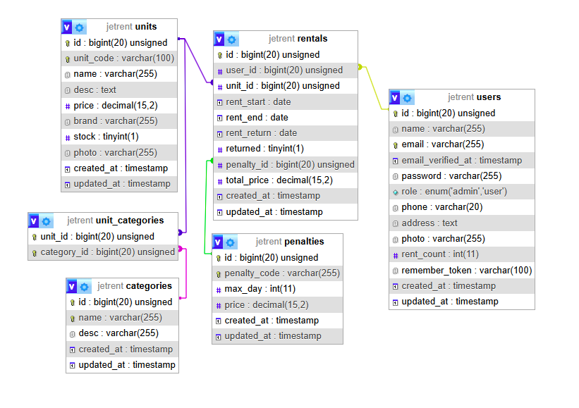

# jetRent I Website Penyewaan Jet Pribadi
by : AADL 

# Gambaran Umum Proyek
Proyek ini adalah platform berbasis web yang dirancang untuk menyewakan jet pribadi. Platform ini memungkinkan pengguna untuk melihat jet yang tersedia, menyewanya untuk periode tertentu, serta menangani pembayaran dan penalti jika ada keterlambatan pengembalian. Sistem ini mencakup akses berbasis peran untuk admin dan pengguna, yang memudahkan pengelolaan penyewaan jet.

# Fitur
1. Manajemen Kategori Jet
    Admin dapat mendefinisikan kategori untuk jet, memastikan klasifikasi yang jelas dan memudahkan pencarian bagi pengguna.
    
2. Manajemen Unit Jet
    Jet diklasifikasikan ke dalam unit dengan detail spesifik seperti harga, merek, ketersediaan, dan deskripsi.

3. Manajemen Pengguna
    Pengguna dapat mendaftar, melihat jet yang tersedia, dan menyewa jet untuk tanggal tertentu. Admin dapat mengelola pengguna, termasuk melihat riwayat penyewaan mereka.

4. Manajemen Penyewaan
    Pengguna dapat menyewa jet dan mengembalikannya dalam periode sewa yang ditentukan. Pengembalian yang terlambat akan dikenakan penalti.

5. Manajemen Penalti
    Admin dapat mendefinisikan penalti untuk pengembalian terlambat, termasuk hari maksimal penyewaan dan biaya denda yang sesuai.

# Skema Database

